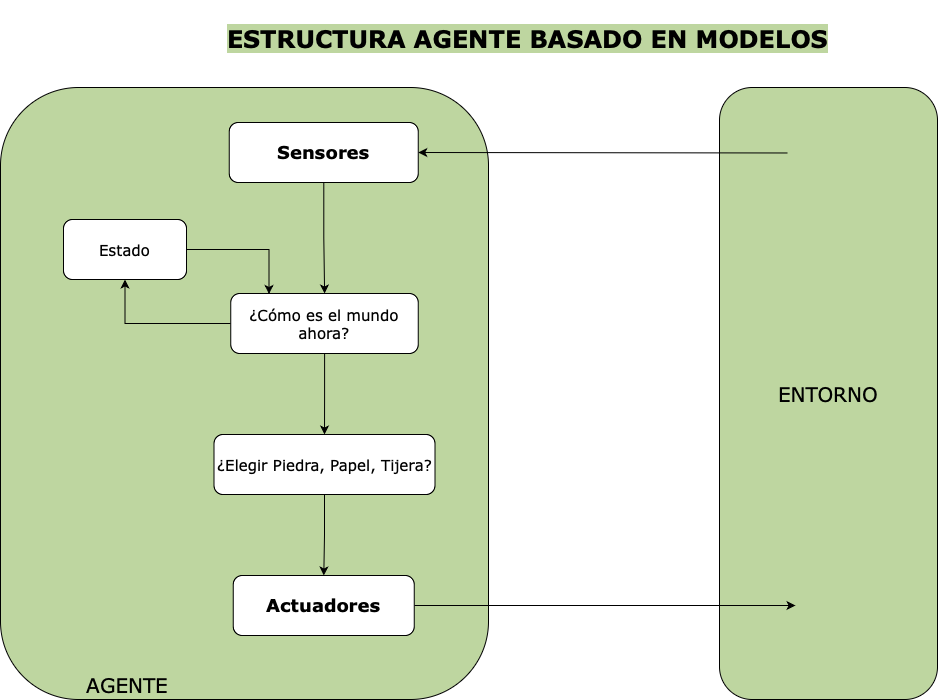

Práctica Agentes Inteligentes
=============================

## 0. Introducción
Este proyecto implementa un agente inteligente para jugar al juego de Piedra, Papel, Tijera, utilizando una estructura basada en modelos. El objetivo principal es crear un sistema capaz de aprender de las elecciones del usuario para detectar patrones y adapte su comportamiento para maximizar sus posibilidades de ganar.

El lenguaje de programación elegido para desarrollar este agente es `Python`.
## 1. Tabla de propiedades del entorno
Contorno de tareas | Observable| Agentes | Determinista | Episódico | Estático | Discreto | Conocido
:---: | :---: | :---: | :---: | :---: | :---: | :---: | :---: |
 RPS | Parcialmente | MultiAgente | No determinista | Secuencial | Estático |  Discreto |  Conocido |

 ### Justificación

- _Parcialmente Observable_: el agente no conoce qué decisión tomará el oponente antes de hacer su elección, la observabilidad está limitada a los resultados de los turnos anteriores.

- _Multi-agente_: El juego de piedra, papel o tijera involucra a al menos dos jugadores.

- _No determinista_: No se conoce en qué estado se encontrará "el mundo" una vez el agente tome una decisión, ya que dependerá de la elección del rival, la cual puede ser aleatoria o impredecible.

- _Secuencial_: Considero que se pueden emplear estrategias en base al historial de elecciones del oponente, por lo que sería posible inferir patrones de comportamiento.

- _Estático_: El estado del entorno no cambia mientras el agente toma su decisión.

- _Discreto_: Las opciones disponibles (piedra, papel o tijera) son finitas y claramente definidas.

- _Conocido_: El entorno es conocido porque las reglas del juego no varían y son conocidas por los jugadores.

## 2. Identificación del tipo de agente y estructura
El agente desarrollado es de tipo **agente basado en modelos** (Model-Based Reflex Agent). No se limita únicamente a reaccionar de manera simple al estado actual, sino que utiliza un modelo interno basado en el historial de elecciones del jugador para mejorar su toma de decisiones. Algunas de sus características principales son:

- Memoria del entorno: Dado que el entorno es parcialmente observable, mantiene un registro del historial de acciones del jugador.

- Predicción basada en el modelo: Analiza dicho historial (como la acción favorita del jugador o las transiciones entre elecciones) para intentar identificar patrones de comportamiento y anticiparse a las acciones del oponente.

- Reacción adaptativa: Se adapta al modelo interno de cada oponente, con lo cual selecciona una acción que contrarreste la predicción más probable en cada caso.

Explicación del gráfico: 

- Entorno: es el usuario que interactúa con el agente. El usuario proporciona entradas (elección de piedra, papel o tijera) y recibe las salidas del agente (movimiento elegido y resultado de la partida). 

- Agente: es el programa que recibe las entradas del usuario y toma la mejor decisión posible basándose en su modelo interno y las interacciones previas. 

- Sensores: se encargan de que el agente perciba el estado actual del entorno. 
    - Código relacionado en `main.py`
    - `get_user_action()` obtiene la elección del usuario (piedra,papel o tijera)

- ¿Cómo es el mundo ahora?: se corresponde con el estado interno del agente. El estado incluye tanto el historial de las elecciones del usuario como los patrones que el agente ha identificado. El agente utiliza este estado para interpretar el contexto actual.
    - Código relacionado en `history.py`
    - `user_history` almacena el historial completo de elecciones del usuario.
    - `next_move` analiza las secuencias de elecciones del usuario, permitiendo al agente identificar patrones

- Estado: se corresponde con la información almacenada sobre el historial del usuario y los patrones identificados. Este estado se actualiza dinámicamente con cada nueva interacción.
    - Código relacionado en `history.py`
    - `update_user_history()` actualiza el historial y las secuencias observadas.
    - `predict_user_action()` utiliza el estado actual (historial y patrones) para predecir la próxima elección del usuario

- ¿Elegir Piedra, Papel o Tijera?: representa la decisión del agente sobre qué acción tomar utilizando su predicción del próximo movimiento del usuario para elegir la acción que la contrarreste.
    -  Código relacionado en `history.py`
    - `predict_user_action()` Predice la próxima acción del usuario. También añade un factor de aleatoriedad para evitar que el usuario sea capaz de descifrar el patrón de comportamiento del agente.
    - Código relacionado en `constants.py`
    - `Victories` define las reglas para contrarrestar la predicción.

- Actuadores: representan la acción elegida por el agente y su comunicación al entorno (el usuario). Esto incluye mostrar el resultado de cada ronda y actualizar el historial.
    - Código relacionado en `main.py` y `game_logic.py` los `print()` statements comunican al usuario las decisiones del agente, su propia elección y el resultado del juego.

## Bibliografía

Russell, Peter. ARTIFICIAL INTELLIGENCE : A Modern Approach, Global Edition. S.L., Pearson Education Limited, 2021.